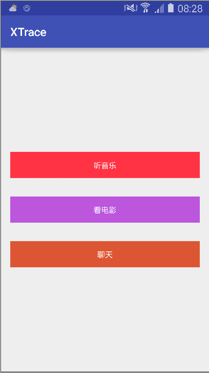
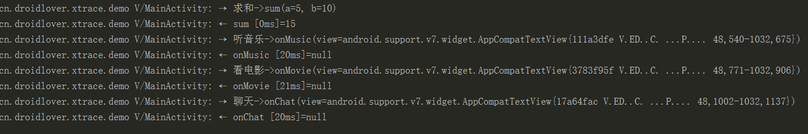

# XTrace


[XTrace](https://github.com/limedroid/XTrace.git)是AOP在Android的简单实践，踩了一系列坑。希望能帮助您
将AOP运用到Android。欢迎star、fork，期待提出您的宝贵意见。

>以下是我的踩坑笔记

### AOP概述
    
做过J2EE开发的同学对AOP一定非常熟悉，在J2EE中，面向切面编程的实现一般有AspectJ、Spring Aop等，抱歉，我只用过这两个。AOP的主要名词   有：Aspect、Pointcut、Advise等。在这里，我选用AspectJ做Android平台的AOP。

### Gradle插件
    
AspectJ是在编译阶段对字节码进行操作，因此需要它独立的编译器ajc。在Android Studio中，可以通过Gradle脚本启用ajc编译器。为了方便开发AOP，我搞了个小插件（很简单的），在需要引入AOP的library或Application中引入就好。
    
```
buildscript {
    repositories {
        jcenter()
    }
    dependencies {
        classpath 'cn.droidlover:AspectJAs:1.0.2'
    }
}

```
在相应的模块中使用插件：
```groovy
apply plugin: 'cn.droidlover.aspectjas'
```

开发Gradle插件遇到的坑
*　需要在java目录下建立resources/META-INF/gradle-plugins目录
*　需要在radle-plugins目录下建立plugin_name.properties文件。如上面的插件名称为cn.droidlover.aspectjas，则该文件名应为：cn.droidlover.aspectjas.properties
*　文件内容为：
```groovy
implementation-class=插件入口path
```
    如上述插件则为：
```groovy
implementation-class=cn.droidlover.aspectjas.AspectJAs
```
    插件入口即 class implements Plugin<Project>的类，每个插件只有一个入口。
* 可以将自己写的插件上传到本地maven仓库
```groovy
apply plugin: 'groovy'
apply plugin: "maven"

dependencies {
    compile gradleApi()
    compile localGroovy()
    compile 'com.android.tools.build:gradle:2.1.0'
}

repositories {
    jcenter()
}

// 上传到本地代码库
uploadArchives{
    repositories{
        mavenDeployer{
            repository(url:uri('../repo'))
            pom.groupId = 'cn.droidlover' // 组名
            pom.artifactId = 'AspectJAs' // 插件名
            pom.version = '1.0.2' // 版本号
        }
    }
}
```

使用的时候只需要加上maven地址就好：
```groovy
maven{
     url uri('/repo')
}
```

### XTrace说明
XTrace的目标是具有@Trace注解的方法，其主要功能是：将执行方法标识、执行方法名称、执行参数传值、执行时间、返回值等进行Log日志输出。

<p align="center">
  
</p>

运行截图

<p align="center">
  
</p>

使用方法：

```java
@Trace("聊天")
public void onChat(View view) {
    try {
        Thread.sleep(20);
    } catch (InterruptedException e) {
           e.printStackTrace();
    }
}

@Trace("求和")
private int sum(int a, int b) {
    return a + b;
}
```

您可以根据这个进行扩展，比如进行用户行为的统计等。


